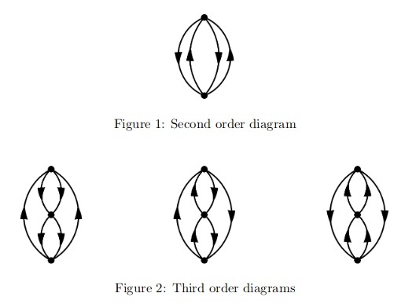
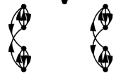

## Hugenholtz Diagrams

The idea is to analytically generate all the Hugenholtz diagrams of a given order. An approach is given [here](http://cds.cern.ch/record/609508/files/0303069.pdf). Also see Szabo and Ostlund (pg 256-262).

The perturbation series for the ground state energy can be given by diagrams in the Hugenholtz vein constructed according to the following rules 
For an *n*<sup>th</sup> order diagram, n dots (vertices) are drawn in a column. These vertices are connected by directed lines subject to the conditions
1. Each vertex has two lines pointing in and two pointing out.
2. Each diagram is connected, i.e.  one must be able to go from any one vertex to any other by following some number of lines.
3. No line connects a vertex with itself.
4. Each diagram is topologically distinct.

We will number vertices from 0 at the top, and down arrows are 'holes' (labelled a,b,c,...) and up arrows 'particles' (labelled r,s,t,...).



For order *n* there will be &half;*n*(*n*-1) pairs of nodes. So for order 2 there will be &half;2.1=1, and for 3 there will be &half;3.2=3 pairs as seen above.
```python
def nodalPairCount_hh(order):
    #return the number of pairs of nodes in Hugenholtz diagrams of 'order'
  
    return int(0.5 * order * (order- 1))
```   
For a diagram of order *n* there will be a total of 2*n* lines joining nodes in the diagram
```python
def nodalLineCount_hh(order):
    #return the total number of line connecting nodes in the diagram
    
    return 2 * order
```
First generate a list of nodal pairs, we will number the nodes 0, 1, 2, ...
```python
def nodalPairs_hh(order):
    #return number of nodal pairs in  diagram of 'order'
    
    pairs = []
    
    for p in range(order):
        for q in range(p+1, order):
            pairs.append([p, q])
            
    return pairs 
```
We need a list of lists of all combinations of connections between the pairs. Each element of the list will be the number of nodal pairs long. We generate it by a recursive subroutine which initially takes a list of zeros, nodal pairs long, and a pair number 0 initially. So for order 3 it will take \[0,0,0] and 0. The routine then appends to the initial list all possibilities on on the pair number ie \[0,0,0],\[1,0,0],\[2,0,0],\[3,0,0]. This list is then passed back to the routine with the pair number incremented, and so on until the pair number exceeds the number of nodal pairs. We can reduce the number of combinations by not allowing those where the sum of the connections exceeds the number of lines of the diagram order as any subsequent connections will still be above the limit. Once all pairs have been processed a routine is called to verify that the combination is valid according to the rules. So a diagram specification of \[2,2,2] means there are 2 connections between nodes 0 and 1, 2 connections between 0 and 2 and 2 connections between 1 and 2. 
```python
connections = [[0] * nodalPairCount_hh(order)]
nodePair = 0
pairCount = nodalPairCount_hh(order)

def nodalPairConnectionsCombinations_hh(connections, nodePair, pairCount, order):
    #generate all combinations of connections between pairs
    
    #recursive return
    
    if nodePair == pairCount: 
        return validDiagrams_hh(connections,order)
    
    #define maximum number of connections
    limit = 3
    
    #adjust for special case order 2
    if order == 2: limit += 1
    
    #make copy of connections as we are modifying it and don't want to processed appended elements
    c = connections.copy()

    #loop over all elements in original connection list
    for connection in connections:    
    
        #loop over all possible connection types, 
        for i in range(1, limit+1):

            #make copy of current connection
            t = connection.copy()
            t[nodePair] = i

            #if sum of elements is less than or equal to allowed lines in diagram save
            if sum(t) <= 2 * order:
                c.append(t)
                
    #don't need original list now
    del connections
        
    #increment the nodePair
    nodePair += 1
      
    #recurse
    node = nodalPairConnectionsCombinations_hh(c, nodePair, pairCount, order)
        
    return node
```
Now need to check that connection combinations are valid. There are two checks (1.) That the total number of connections equals the number of lines (2 times order) and (2.) That the diagram is connected ie you can get from node 0 to node order-1 via all other nodes. The first pair is always 0->1. *tested* is an array initially set to False values that are set to true when a nodal pair has contributed to the route (the first element is True as we essentially start at node 1).
```python
def validDiagrams_hh(diagrams, order):
    #perform checks on diagrams for validity
    
    verified = []
    passed = False
    
    #get list of nodal pairs
    nodalPair = nodalPairs_hh(order)
    pairCount = nodalPairCount_hh(order)

    #number of lines
    for d in diagrams:
    
        if sum(d) == 2* order: 
        
            #check line count for diagram
            vertex = [0] * order
          
            #accummulate lines to each node
            for i in range(pairCount):
                vertex[nodalPair[i][0]] += d[i]
                vertex[nodalPair[i][1]] += d[i]
          
            #check correct number of lines at node
            if vertex == [4] * order:
          
                #number of lines at nodes verified check connected
                route = [0,1]
                node = 1
                tested = [False] * pairCount
                tested[0] = True
          
                #loop over nodes to be found
                while True:
          
                    #loop over nodal pairs
                    for i in range(pairCount):
            
                        pair = nodalPair[i]
              
                        #has pair been checked
                        if not tested[i]:
              
                            #is current node in nodal pair
                            if node == pair[0]: 
                                route.append(pair[1])
                                node = pair[1]
                            elif node == pair[1]: 
                                route.append(pair[0])
                                node = pair[0]
                            tested[i] = True
                                  
                    #all nodes tested leave while loop
                    if all(t == True for t in tested): break
                
                #have we got all nodes, make unique and sort
                route = list(set(route))
                route.sort()
                passed = True
                for i in range(order):
                    if i != route[i]: passed = False

                if passed: verified.append(d)
        
    return verified
```
We have our valid diagrams. Next determine the number of up arrow lines. The diagrams deemed valid are considered one at a time.
```python
def upArrowCombinations_hh(diagramCombinations,order):
    #get all combinations of up arrows

    for i in diagramCombinations:

        nodePair = -1
        pairCount = nodalPairCount_hh(order)

        arrows = [0] * pairCount
        upArrow_hh(arrows, nodePair, i, nodalPairs_hh(order), pairCount, order) 


    return
```
The diagram pairs are considered in turn and the combinations of possible up arrow configurations generated recursively. When all pairs have been processed the resulting up arrow configuration is tested for consistency.

```python
def upArrow_hh(up, nodePair, diagram, pairs, pairCount, order):
    #up arrow combinations for diagram

    if nodePair == pairCount-1: 

        passed = verifyArrow_hh(up, pairs, diagram, order)
        if passed: diagrams_hh.append([diagram,up.copy()])

        return 

    nodePair += 1

    #get limits of up connections
    lo = max(diagram[nodePair] - 2, 0)
    hi = min(diagram[nodePair],2)

    #generate combination within range
    for i in range(lo, hi+1):

        up[nodePair] = i
        upArrow_hh(up, nodePair, diagram, pairs, pairCount, order)

    nodePair -= 1

    return 
```
This routine tests for validity of an up arrow configuration. The number of up arrows at each node is determined and then checked for all nodes to have exactly 2 up arrow lines.
```python
def verifyArrow_hh(up, pairs, diagram, order):
    #check up arrow combination compatible with original diagram

    nodes = np.zeros(order)

    #loop over all pairs of nodes
    for n, pair in enumerate(pairs):
        i = pair[0]
        j = pair[1]

        #sum up arrows at each node
        if i < j:
            nodes[j] += up[n]
            nodes[i] += diagram[n] - up[n]
        else:
            nodes[i] += up[n]
            nodes[j] += diagram[n] - up[n]

    passed = True
    for i in range(order): 
        if nodes[i] != 2: passed = False 

    return passed
```
The whole procedure is run as
```python
import numpy as np

order = 4
diagrams_hh = []

pairCount = nodalPairCount_hh(order)
connections = [[0] * pairCount]
nodePair = 0

diagramCombinations = nodalPairConnectionsCombinations_hh(connections, nodePair, pairCount, order)
upArrowCombinations_hh(diagramCombinations, order)

d = []

for i, diagram in enumerate(diagrams_hh):
    if diagram[0]  != d:
        print('Base diagram ', diagram[0])
        d = diagram[0]  
    print('           arrow combination [',i,'] ', diagram[1])
```
for order 3...
```
Base diagram  [2, 2, 2]
           arrow combination [ 0 ]  [0, 2, 0]
           arrow combination [ 1 ]  [1, 1, 1]
           arrow combination [ 2 ]  [2, 0, 2]
```
for order 4...
```
Base diagram  [0, 1, 3, 3, 1, 0]
           arrow combination [ 1 ]  [0, 0, 2, 2, 0, 0]
           arrow combination [ 2 ]  [0, 1, 1, 1, 1, 0]
Base diagram  [0, 2, 2, 2, 2, 0]
           arrow combination [ 3 ]  [0, 0, 2, 2, 0, 0]
           arrow combination [ 4 ]  [0, 1, 1, 1, 1, 0]
           arrow combination [ 5 ]  [0, 2, 0, 0, 2, 0]
Base diagram  [0, 3, 1, 1, 3, 0]
           arrow combination [ 6 ]  [0, 1, 1, 1, 1, 0]
           arrow combination [ 7 ]  [0, 2, 0, 0, 2, 0]
Base diagram  [1, 0, 3, 3, 0, 1]
           arrow combination [ 8 ]  [0, 0, 2, 1, 0, 0]
           arrow combination [ 9 ]  [1, 0, 1, 2, 0, 1]
Base diagram  [2, 0, 2, 2, 0, 2]
           arrow combination [ 10 ]  [0, 0, 2, 0, 0, 0]
           arrow combination [ 11 ]  [1, 0, 1, 1, 0, 1]
           arrow combination [ 12 ]  [2, 0, 0, 2, 0, 2]
Base diagram  [3, 0, 1, 1, 0, 3]
           arrow combination [ 13 ]  [1, 0, 1, 0, 0, 1]
           arrow combination [ 14 ]  [2, 0, 0, 1, 0, 2]
Base diagram  [1, 3, 0, 0, 3, 1]
           arrow combination [ 15 ]  [0, 2, 0, 0, 1, 1]
           arrow combination [ 16 ]  [1, 1, 0, 0, 2, 0]
Base diagram  [2, 2, 0, 0, 2, 2]
           arrow combination [ 17 ]  [0, 2, 0, 0, 0, 2]
           arrow combination [ 18 ]  [1, 1, 0, 0, 1, 1]
           arrow combination [ 19 ]  [2, 0, 0, 0, 2, 0]
Base diagram  [3, 1, 0, 0, 1, 3]
           arrow combination [ 20 ]  [1, 1, 0, 0, 0, 2]
           arrow combination [ 21 ]  [2, 0, 0, 0, 1, 1]
Base diagram  [1, 1, 2, 2, 1, 1]
           arrow combination [ 22 ]  [0, 0, 2, 1, 0, 0]
           arrow combination [ 23 ]  [0, 1, 1, 0, 1, 0]
           arrow combination [ 24 ]  [0, 1, 1, 1, 0, 1]
           arrow combination [ 25 ]  [1, 0, 1, 1, 1, 0]
           arrow combination [ 26 ]  [1, 0, 1, 2, 0, 1]
           arrow combination [ 27 ]  [1, 1, 0, 1, 1, 1]
Base diagram  [1, 2, 1, 1, 2, 1]
           arrow combination [ 28 ]  [0, 1, 1, 0, 1, 0]
           arrow combination [ 29 ]  [0, 1, 1, 1, 0, 1]
           arrow combination [ 30 ]  [0, 2, 0, 0, 1, 1]
           arrow combination [ 31 ]  [1, 0, 1, 1, 1, 0]
           arrow combination [ 32 ]  [1, 1, 0, 0, 2, 0]
           arrow combination [ 33 ]  [1, 1, 0, 1, 1, 1]
Base diagram  [2, 1, 1, 1, 1, 2]
           arrow combination [ 34 ]  [0, 1, 1, 0, 0, 1]
           arrow combination [ 35 ]  [1, 0, 1, 0, 1, 0]
           arrow combination [ 36 ]  [1, 0, 1, 1, 0, 1]
           arrow combination [ 37 ]  [1, 1, 0, 0, 1, 1]
           arrow combination [ 38 ]  [1, 1, 0, 1, 0, 2]
           arrow combination [ 39 ]  [2, 0, 0, 1, 1, 1]
```
For example
```
Base diagram  [3, 1, 0, 0, 1, 3]
           arrow combination [ 20 ]  [1, 1, 0, 0, 0, 2]           
           arrow combination [ 21 ]  [2, 0, 0, 0, 1, 1]
```           
corresponds to the two 4th order diagrams 

To get the down arrows subtract the up arrows at each pair from the number of pairs at each node (take absolute value). So eg if \
\[3,1,0,0,1,3] is the base diagram and \[1,1,0,0,0,2] is the up arrow combination then \[2,0,0,0,1,1] is the down arrow combination. The code is
```python
def downArrow_hh(diagram, arrow, pairs):
    #compute the down arrows from an up arrow specification

    down = [0] * pairs
    for pair in range(pairs):
        down[pair] = abs(diagram[pair] - arrow[pair])
    
    return down
```
It is possible (but not easy) to draw the diagrams using pyplot and patches.Arc. Here's an example of output from a routine which does this


In order to evaluate eg MPn terms we will need to define a detailed specification of the connections in the diagram. For a specific diagram there will be 4 lines at each node, 2 going in and 2 going out. Our full specification will then be 4 times the number of nodes long, each specification will be of the form \[node1, node2, direction of arrow, whether in or out of node, identifier] eg \[1,2,'d'.'i','a'] and if this is the nth element of specification vector then it relates to node n//4. Like Szabo & Ostlund we have numbered nodes from the bottom up.
The routine to do this is
```python
def connectionFlow_hh(up, down, order):
    #determine characteristics of each node

    #special case order 2
    if order == 2: return [[0,1,'d','o','a'],[0,1,'d','o','b'],[0,1,'u','i','r'], [0,1,'u','i','s'], \
                           [0,1,'d','i','a'],[0,1,'d','i','b'],[0,1,'u','o','r'], [0,1,'u','o','s']]

    def nodalFlow(pair, p, a, d, id, flows):
        #assign flow list element

        i, j= pair
        la = [i, j, a, d, id]
        id += 1

        #allow for two lines in same direction between same pair
        if p == 2: 
            lb = [i, j, a, d, id]
            id += 1
            flows.append(la)
            flows.append(lb)
        else: flows.append(la)

        return id, flows

    pairs = nodalPairs_hh(order)
    id = 1
    flowPattern = []

    for node in range(order):

        for i, pair in enumerate(pairs):

            #determine defining attributes of each line
            if node == pair[0] and up[i] != 0:
                id, flowPattern = nodalFlow(pair, up[i], 'u', 'o', id, flowPattern)
            if node == pair[0] and down[i] != 0:
                id, flowPattern = nodalFlow(pair, down[i], 'd', 'i', id, flowPattern)
            if node == pair[1] and up[i] != 0:
                id, flowPattern = nodalFlow(pair, up[i], 'u', 'i', id, flowPattern)
            if node == pair[1] and down[i] != 0:
                id, flowPattern = nodalFlow(pair, down[i], 'd', 'o', id, flowPattern)

    #rationalize numbering so each line has unique number
    connection = 0
    processed = []
    while connection != 2 * nodalLineCount_hh(order) :

        #current connection
        i,j,a,d,id = flowPattern[connection]

        #see if match in other direction
        for f in range(connection+1, len(flowPattern)):
            if flowPattern[f][:3] == [i,j,a] and flowPattern[f][3] != d :

                #if not already changed relabel and mark as changed
                if not f in processed:
                    flowPattern[f][4] = id
                    processed += [f]
                    break

        connection += 1

    #change to symbols
    holes =     ['a','b','c','d','e','f','g','h']
    particles = ['r','s','t','u','v','w','x','y']

    for i, line in enumerate(flowPattern):

        ID = line[4]
        if str(ID).isdigit():
            if line[2] == 'd': id = holes[0]
            else: id = particles[0]

            for j in range(i, len(flowPattern)):
                if flowPattern[j][4] == ID: flowPattern[j][4] = id

            if id in holes: del holes[0]
            else: del particles[0]
    
    return flowPattern
```
this will result in, for \[2,1,1,1,1,2] \[2,0,0,1,1,1]
```
[[0, 1, 'u', 'o', 'r'], [0, 1, 'u', 'o', 's'], [0, 2, 'd', 'i', 'a'], [0, 3, 'd', 'i', 'b'], [0, 1, 'u', 'i', 'r'], [0, 1, 'u', 'i', 's'], 
 [1, 2, 'u', 'o', 't'], [1, 3, 'u', 'o', 'u'], [0, 2, 'd', 'o', 'a'], [1, 2, 'u', 'i', 't'], [2, 3, 'u', 'o', 'v'], [2, 3, 'd', 'i', 'c'], 
 [0, 3, 'd', 'o', 'b'], [1, 3, 'u', 'i', 'u'], [2, 3, 'u', 'i', 'v'], [2, 3, 'd', 'o', 'c']]
```
this fully defines the diagram.

The first two rules for translating diagrams into algebraic expressions are:

1.  Each dot contributes an antisymmetric matrix element <in<sub>1</sub>in<sub>2</sub>||out<sub>1</sub>out<sub>2</sub>> to the numerator.
2.  Each pair of adjacent vertices contributes the denominator factor **&Sigma;** &epsilon;<sub>holes</sub> - **&Sigma;** &epsilon;<sub>particles</sub> 
    where the sums run over the labels of all hole and particle lines ceossing an imaginary line separating the pair of vertices.
    
Rule 1 can be evaluated by eg
```python

    rules = []

    eri = ''

    for i in range(order):

        nodalFlow = flows[4*i: 4*i+4]
        #sort to get 'in' lines first        
        nodalFlow.sort(reverse = False, key=lambda i :i[3])

        eri += nodalFlow[0][4] + nodalFlow[1][4] + nodalFlow[2][4] + nodalFlow[3][4] + ','
    
    rules.append(eri[:-1])
```
and Rule 2
```python
    levels = []
    for level in range(order-1):
        
        e = ''
        for f in flows:
            i,j,a,d,id = f

            #stop double counting by just taking 'in'
            if d == 'o': continue
            if i <=  level and j > level:

                if a == 'd': 
                    e += '+' + id
                else: e += '-' + id

        levels.append(e[1:])
    rules.append(levels)
```
These will return the following strings
```
'abrs,rstu,tcav,uvbc', ['a+b-r-s', 'a+b-t-u', 'b+c-u-v']
```
We must now evalute the rules for determining the sign of the expression

3.  The overall sign of the expression is(-1)<sup>h+l</sup>, where *h* and *l* are the number of hole lines and closed loops respectively. 
4.  Sum expression over all hole and particle indices.
5. Multiply the expression by a weight factor 2<sup>-2</sup>, where k is the number of equivalent lines. Two lines are equivalent is they share the same nodes and their directions are the same.

We can evaluate these rules by eg
```python
    h = 0
    for f in flows:
        if f[2] == 'd': h += 1

    #get string of labels
    eri = rules['doubleBars'].replace(',','')

    labels = []
    cycles = []

    current = 0

    while True:

        #target of cycle
        target = eri[current]

        labels.append(target)
        cycle = target + '->'

        #search string cyclically
        while True:

            current += 2
            next = eri[current]
            labels.append(next)

            cycle += next + '->'
            if target == next: break

            if next in eri[current+1:]:
                current = eri.index(next, current+1) 
            else:
                current = 0
                current = eri.index(next, current+1)

        #cycle finished
        cycles.append(cycle[:-2])
        cycle = ''

        #see if we've done all labels
        visited = True
        for i, a in enumerate(eri):
            if a not in labels: 
                visited = False
                break

        if visited: break

        #start where label still not visited
        current = i

    rules['sign'] = [h//2, len(cycles)]
    rules['cycles'] = cycles

    #rule 5

    equivalent = []
    for f in flows:
        if f[3] == 'i': equivalent.append(f)
    equivalent.sort()

    count = 0
    for i in range(len(equivalent)-1):
        if equivalent[i][:3] == equivalent[i+1][:3]:
            count += 1
  
    rules['powerTwo'] = -count
```
This will output
```
[3, 3], ['a->r->t->a', 'b->s->u->b', 'c->v->c'], 1
```
For the 3 3rd order diagrams the results are
```
[0,2,0]
['abrs,cdab,rscd', ['a+b-r-s', 'c+d-r-s'], [4, 2], ['a->r->c->a', 'b->s->d->b'], 3]

[2,0,2]
['abrs,rstu,tuab', ['a+b-r-s', 'a+b-t-u'], [2, 2], ['a->r->t->a', 'b->s->u->b'], 3]

[1,1,1]
['abrs,rcat,stbc', ['a+b-r-s', 'b+c-s-t'], [3, 3], ['a->r->a', 'b->s->b', 'c->t->c'], 0]
```
These results can be compared with Szabo & Ostlund pg 361. It is not immediately clear that \[1,1,1] is equivalent to the S&O version, however we can see that
'abrs,rcat,stbc' is since ab are just labels \
'bars,rcbt,stac' which is since rs are also just labels \
'basr,scbt,rtac' which changing order of terms and noting <12||34> = <21||43>
'abrs,cstb,rtac' which is the same as S&O labelling.

The first expression for \[0,2,0] can be readily written as \
(-1)<sup>4+2</sup>(2)<sup>3</sup><ab||rs><cd||ab><rs||cd> / ((&epsilon;<sub>a</sub>+&epsilon;<sub>b</sub>-&epsilon;<sub>r</sub>-&epsilon;<sub>s</sub>)(&epsilon;<sub>c</sub>+&epsilon;<sub>d</sub>-&epsilon;<sub>r</sub>-&epsilon;<sub>s</sub>))

It is possible to write a routine that will output in HTML format the algebraic form of the diagram, below is an example of what can be produced using the <math> facility of HTML


It is also possible to automatically generate python code to evaluate the diagrams. Essentially the string eg 'abrs,rcat,stbc', can be directly used in einsum, an example of the code generated for a diagram defined by \
{'doubleBars': 'abrs,rcab,dect,stde', 'orbitalEnergies': \['a+b-r-s', 'c-s', 'd+e-s-t'], 'sign': \[5, 3], 'cycles': \['a->r->a', 'b->s->d->c->b', 'e->t->e'], 'powerTwo': -3}\
looks like 
```python
f = []
f.append( 1/(eocc.reshape(-1,1,1,1) + eocc.reshape(-1,1,1) - evir.reshape(-1,1) - evir))
f.append( 1/(eocc.reshape(-1,1) - evir))
f.append( 1/(eocc.reshape(-1,1,1,1) + eocc.reshape(-1,1,1) - evir.reshape(-1,1) - evir))
mp = pow(1/2, 3) * np.einsum('abrs,rcab,dect,stde,abrs,cs,dest', MO[o,o,v,v],MO[v,o,o,o],MO[o,o,o,v],MO[v,v,o,o], f[0],f[1],f[2])
```
Once the code is generated the python *exec* method can be used to run the code. See the mbpt module in harpy for details. Harpy can do a SCF+mp2+mp3+mp4 calculation in under 10sec.
